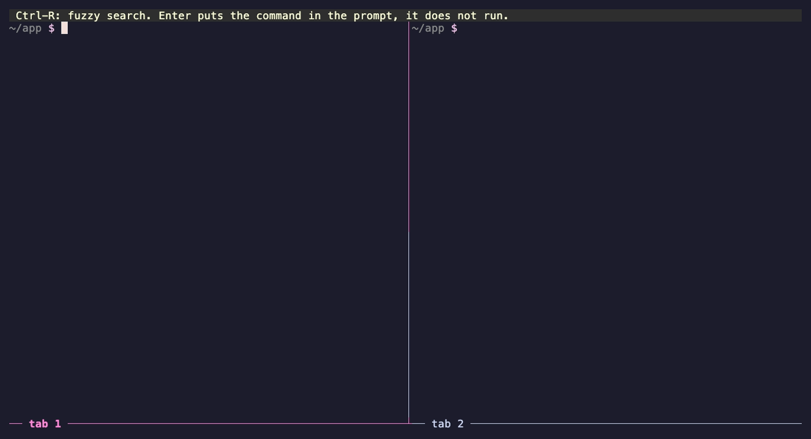
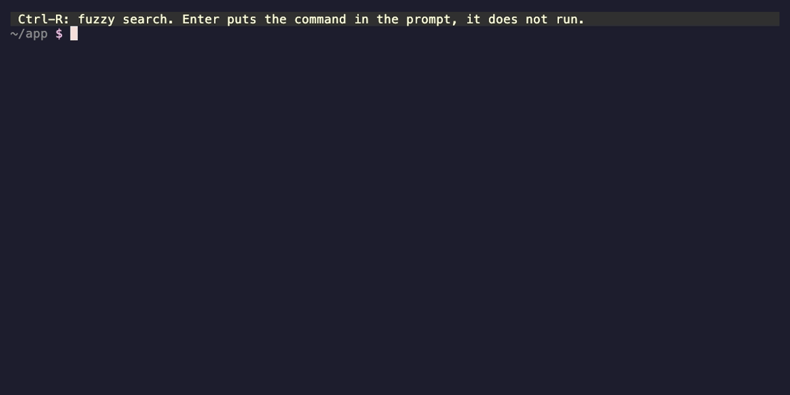
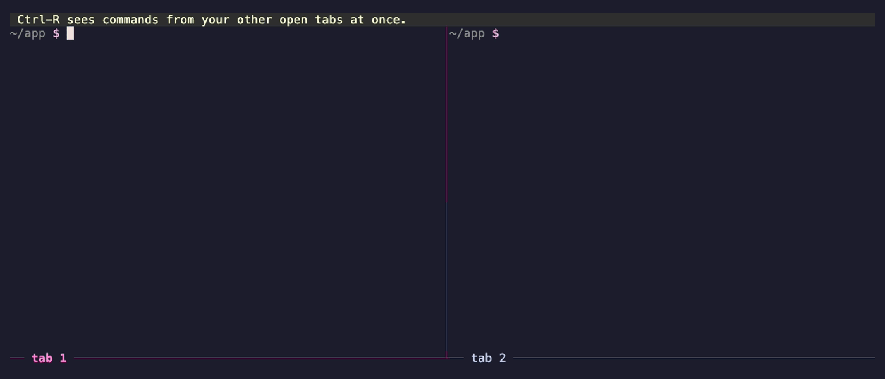
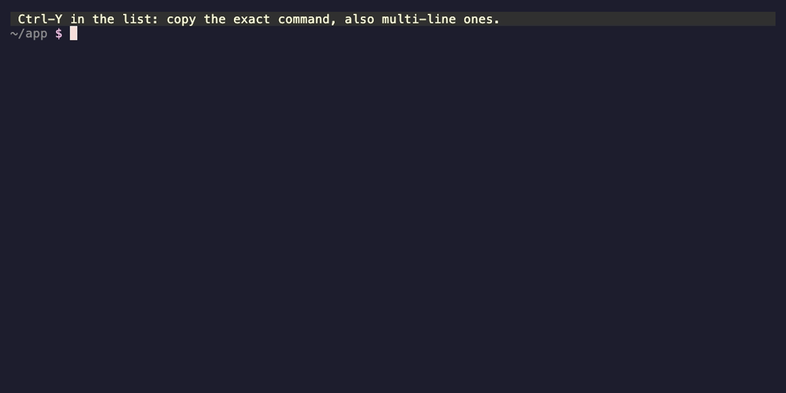
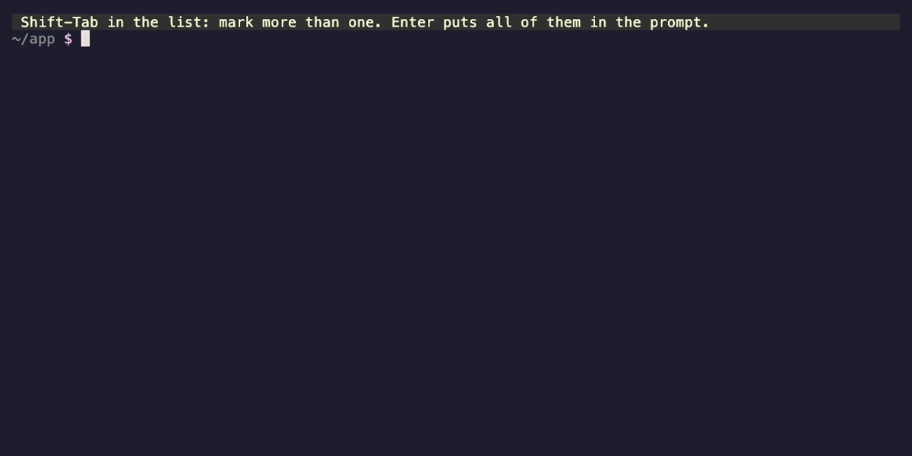
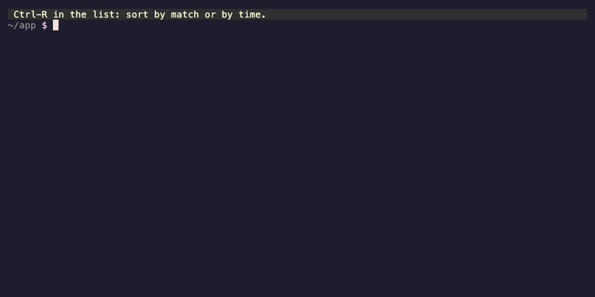
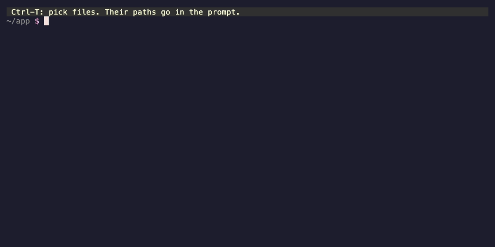
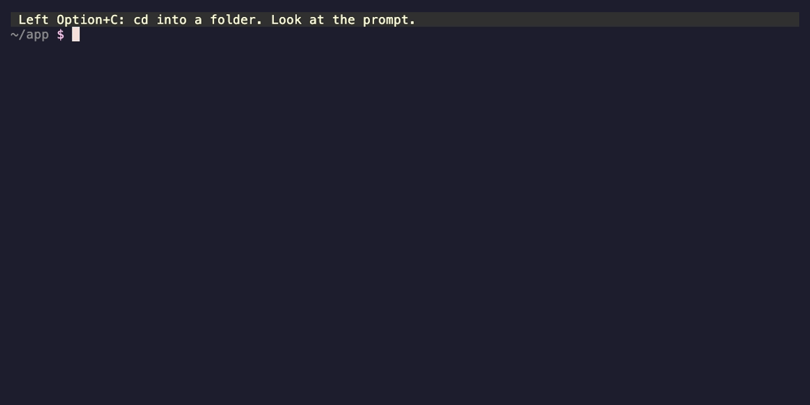
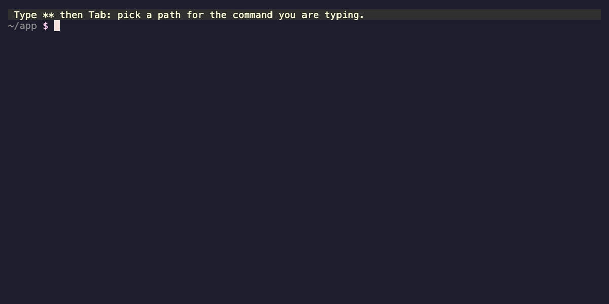

# zsh-fzf-history

Fuzzy Ctrl-R history search for zsh on macOS, with [fzf](https://github.com/junegunn/fzf).



One small file on top of fzf's own key bindings. It adds three things:

- **Ctrl-R sees your other open tabs.** When `share_history` is off, commands that you ran in
  another tab show up at once (for example in the [Otty](https://otty.sh) terminal with per-pane
  history). No duplicate history entries. See [When other tabs show up](#when-other-tabs-show-up).
- **Ctrl-Y copies the exact command** to the clipboard: multi-line commands, backslashes and
  spaces at the end stay as they are.
- **Safe without fzf.** If fzf is not installed, the shell starts with no errors and keeps zsh's own Ctrl-R.

It also turns on fzf's own keys: **Ctrl-T** picks files, **Left Option+C** does cd into a folder,
and `**` then Tab completes paths. See [Keys](#keys) for a short recording of each key.

## Requirements

| Need | Version |
|---|---|
| macOS (Ctrl-Y uses `pbcopy`) | tested on macOS 26 |
| zsh | tested with 5.9 |
| fzf | 0.68 or newer (marking more than one command in the Ctrl-R list), tested with 0.74.4 |
| perl | included in macOS |

## Install

```sh
brew install fzf
git clone https://github.com/fskroes/zsh-fzf-history.git ~/.zsh-fzf-history
```

Add this line to `~/.zshrc`. Put it **after** `source $ZSH/oh-my-zsh.sh` and after any other
plugin that binds Ctrl-R:

```sh
source ~/.zsh-fzf-history/fzf.zsh
```

Open a new terminal tab, or run `exec zsh`.

You do not need oh-my-zsh's `fzf` plugin. If it is in your `plugins=(...)`, remove it:
this file loads the same key bindings.

### Left Option+C needs "Option as Alt"

On macOS the Option key types special characters (for example `ç`), so the shell does not get
Option+C. Set only the **left** Option key to Alt. The right one still types special characters.
fzf calls this key Alt-C.

| Terminal | Setting |
|---|---|
| Otty | `macos-option-as-alt = "left"` in `~/.config/otty/config.toml` |
| Terminal.app | Settings > Profiles > Keyboard > "Use Option as Meta key" (both Option keys) |
| iTerm2 | Settings > Profiles > Keys > General > Left Option Key: "+Esc" |

## Keys

The keys are fzf's own, except Ctrl-Y, which this file adds.
Each key has a short recording in [Each key in action](#each-key-in-action).

| Key | What it does |
|---|---|
| Ctrl-R | Search history. Text you already typed becomes the search. |
| Enter (in the list) | Put the command in the prompt. It does not run. |
| Shift-Tab (in the list) | Mark this command and go to the next one. Enter then puts all marked commands in the prompt, one per line. Tab marks and goes back. |
| Ctrl-Y (in the list) | Copy the command to the clipboard and close the list |
| Ctrl-R (in the list) | Sort by match or by time |
| Ctrl-/ (in the list) | Wrap long lines on or off |
| Ctrl-T | Pick files and put their paths in the prompt. This replaces zsh's transpose-chars. |
| Left Option+C | cd into a folder. fzf calls this key Alt-C. See [Left Option+C needs "Option as Alt"](#left-optionc-needs-option-as-alt). |
| `**` then Tab | fzf completion, for example `cd **<Tab>` or `vim **<Tab>` |

### Each key in action

The top bar of each recording tells what the key does. The pink badge at the top right shows
the key that was pressed last. All recordings use a made-up history, project and clipboard.

#### Ctrl-R: search history

Type parts of the command in any order. Enter puts the command in the prompt; it does not run.
Text that you already typed becomes the search.



#### Ctrl-R sees your other open tabs

Run a command in one tab. Ctrl-R in another open tab finds it at once.
See [When other tabs show up](#when-other-tabs-show-up).



#### Ctrl-Y (in the list): copy the command

Ctrl-Y copies the command exactly as it is, also a multi-line one, and closes the list.



#### Shift-Tab (in the list): mark more than one

Shift-Tab marks a command and goes to the next one. Enter puts all marked commands in the prompt,
one per line.



#### Ctrl-R and Ctrl-/ (in the list): sort and wrap

Ctrl-R sorts by match or by time (`+S` and `-S` in the list show which). Ctrl-/ wraps long lines.



#### Ctrl-T: pick files

Type part of a name. Tab marks more than one file. Enter puts the paths in the prompt.



#### Left Option+C: cd into a folder

Type part of a folder name. Enter changes to that folder at once. fzf shows the command that it
runs, `builtin cd -- <full path>`, above the new prompt.



#### `**` then Tab: complete a path

Type `**` where the path goes, then press Tab. After `cd`, the list shows only folders.



## When other tabs show up

fzf's Ctrl-R reads zsh's history list in memory. With `share_history` off, a tab reads
`$HISTFILE` only when it starts:

```
tab 1 ── runs "make deploy" ──► ~/.zsh_history
                                      │
tab 2 (already open) ── Ctrl-R ──► history in memory   ✗ no "make deploy"
```

This file runs `fc -RI` just before the Ctrl-R list opens. It reads `$HISTFILE` and adds only the
commands that are not already in this tab's history list (zsh manual, `zshbuiltins`, `fc`).
With `share_history` on, zsh already imports those lines itself, and `fc -RI` would add duplicates,
so the file skips it.

| Your history options | Command from another tab shows up in Ctrl-R |
|---|---|
| `share_history` off, `inc_append_history` on (Otty per-pane sets this) | at once |
| `share_history` on (oh-my-zsh default) | after you run one command in this tab (zsh's own timing) |
| `share_history` off, `inc_append_history` off | only after the other tab exits (zsh writes history at exit) |

Details and the options that I compared are in [docs/design.md](docs/design.md).

## Test

The test starts a real interactive zsh in a pseudo-terminal and sends real keys.
It uses a made-up history file and a fake `pbcopy`, so your history and clipboard are not touched.
It takes about one minute.

```sh
python3 tests/verify.py                    # minimal zsh config + fzf.zsh
python3 tests/verify.py --zshrc ~/.zshrc   # your own config (it must source fzf.zsh)
```

If your Mac is slow and a check fails because of timing, run it with `ZFH_TEST_SLOW=2`.

## Demo GIFs

Each GIF in this README comes from the `.tape` file with the same name in [docs/demo/](docs/demo/).
They use a made-up history, project folder and clipboard ([docs/demo/setup.sh](docs/demo/setup.sh)).
To record them again after a change:

```sh
brew install vhs tmux
bash docs/demo/record.sh                  # from the repo root, records all GIFs
bash docs/demo/record.sh ctrl-t option-c  # only these
```

## Uninstall

Remove the `source ~/.zsh-fzf-history/fzf.zsh` line from `~/.zshrc`, then delete `~/.zsh-fzf-history`.

## License

[MIT](LICENSE)
