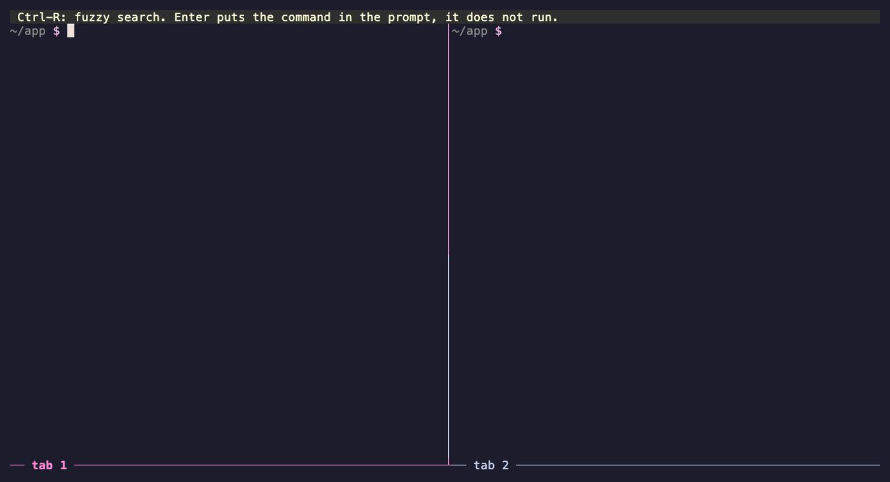
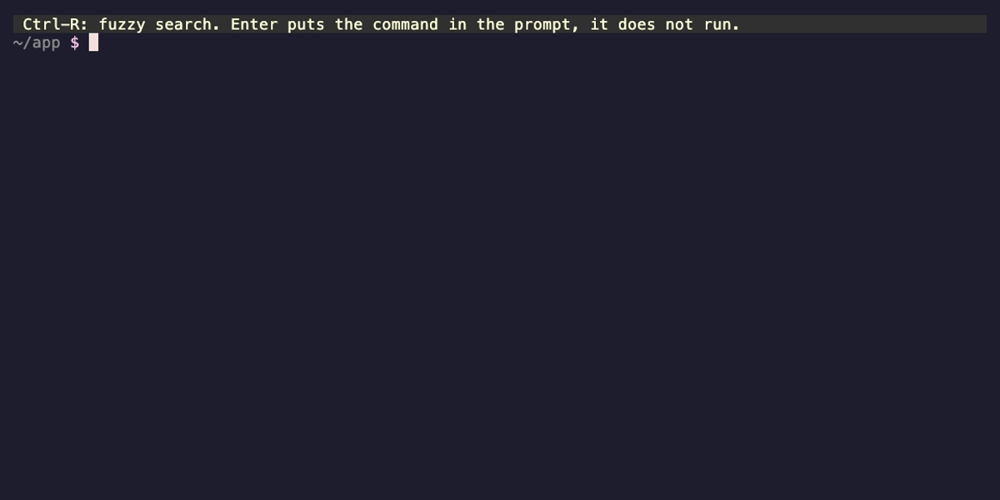
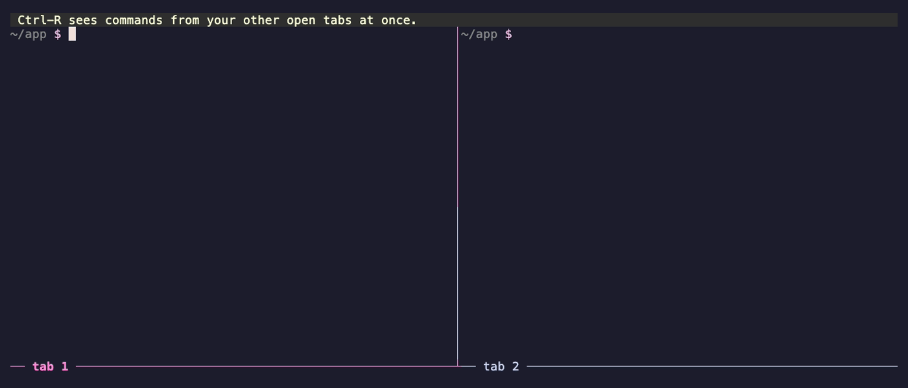
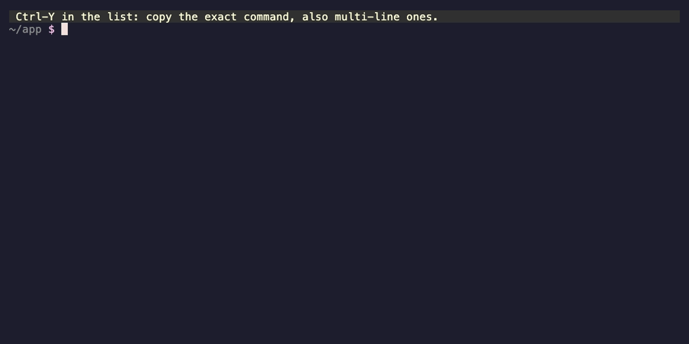
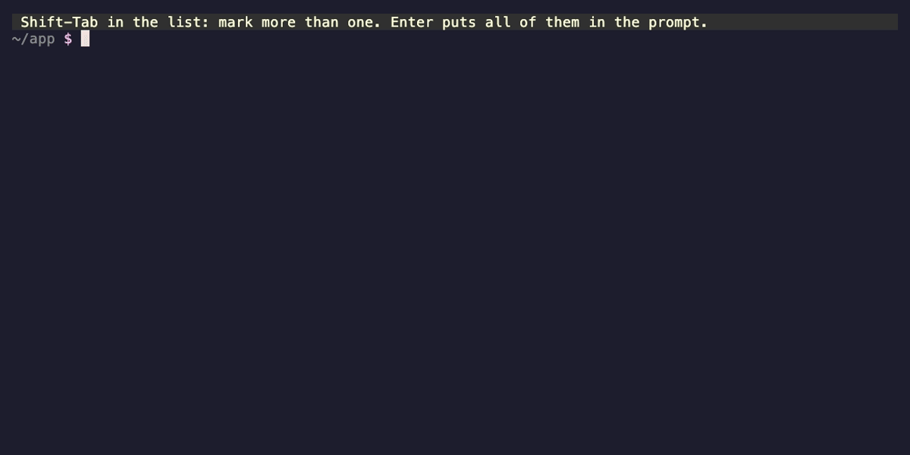
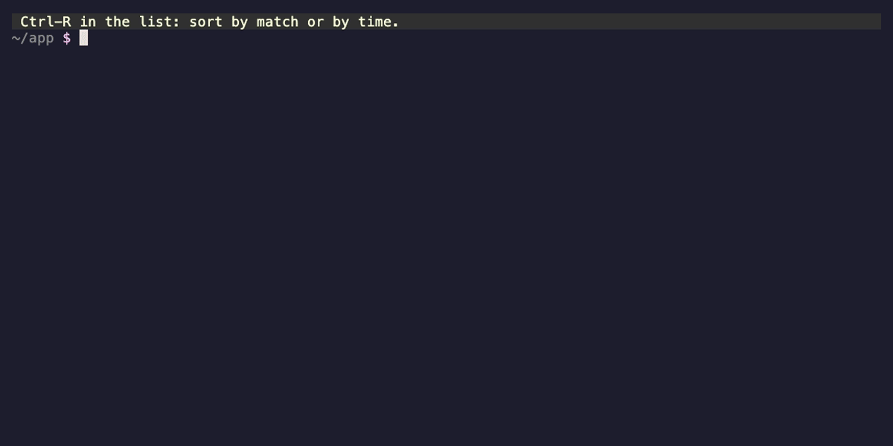
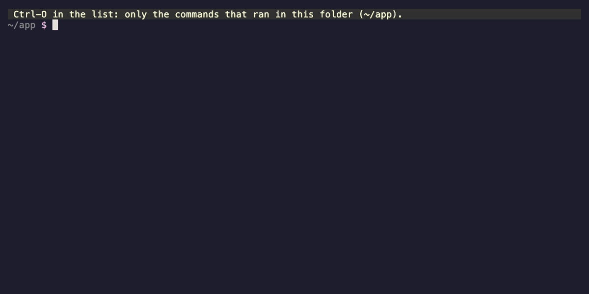
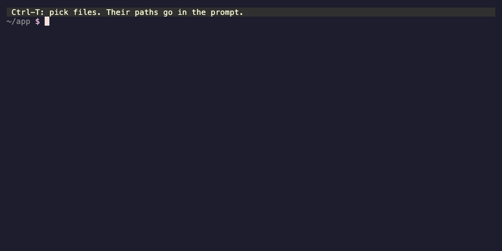
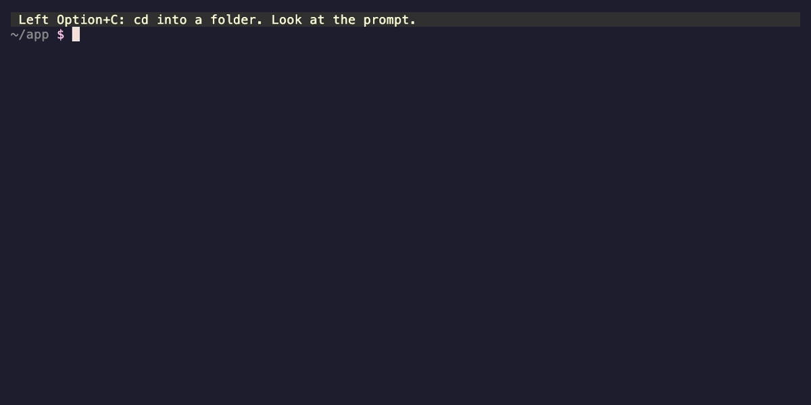
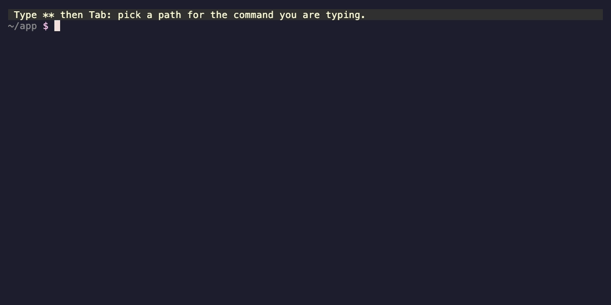

# zsh-fzf-history

Fuzzy Ctrl-R history search for zsh on macOS, with [fzf](https://github.com/junegunn/fzf).



One small file on top of fzf's own key bindings. It adds five things:

- **Ctrl-R lists by time, newest first**, with the date and time of each command. The order
  stays by time while you type; Ctrl-R in the list sorts by match instead.
  See [Sorted by time](#sorted-by-time).
- **Ctrl-O in the Ctrl-R list shows only this folder**: the commands that ran in the current
  folder and its subfolders. Press it again for all commands. It needs `share_history`,
  `inc_append_history` or `inc_append_history_time`. See [Only this folder](#only-this-folder).
- **Ctrl-R sees your other open tabs.** When `share_history` is off, commands that you ran in
  another tab show up at once (for example in the [Otty](https://otty.sh) terminal with per-pane
  history). No duplicate history entries. See [When other tabs show up](#when-other-tabs-show-up).
- **Ctrl-Y copies the exact command** to the clipboard: multi-line commands, backslashes and
  spaces at the end stay as they are.
- **Safe without fzf.** If fzf is not installed, the shell starts with no errors and keeps zsh's own Ctrl-R.

It also turns on fzf's own keys: **Ctrl-T** picks files, **Left Option+C** does cd into a folder,
and `**` then Tab completes paths. See [Keys](#keys) for a short recording of each key.

## Requirements

| Need | Version |
|---|---|
| macOS (Ctrl-Y uses `pbcopy`) | tested on macOS 26 |
| zsh | tested with 5.9 |
| fzf | 0.68 or newer (marking more than one command in the Ctrl-R list), tested with 0.74.4 |
| perl | included in macOS |

## Install

```sh
brew install fzf
git clone https://github.com/fskroes/zsh-fzf-history.git ~/.zsh-fzf-history
```

Add this line to `~/.zshrc`. Put it **after** `source $ZSH/oh-my-zsh.sh` and after any other
plugin that binds Ctrl-R:

```sh
source ~/.zsh-fzf-history/fzf.zsh
```

Open a new terminal tab, or run `exec zsh`.

You do not need oh-my-zsh's `fzf` plugin. If it is in your `plugins=(...)`, remove it:
this file loads the same key bindings.

### Left Option+C needs "Option as Alt"

On macOS the Option key types special characters (for example `ç`), so the shell does not get
Option+C. Set only the **left** Option key to Alt. The right one still types special characters.
fzf calls this key Alt-C.

| Terminal | Setting |
|---|---|
| Otty | `macos-option-as-alt = "left"` in `~/.config/otty/config.toml` |
| Terminal.app | Settings > Profiles > Keyboard > "Use Option as Meta key" (both Option keys) |
| iTerm2 | Settings > Profiles > Keys > General > Left Option Key: "+Esc" |

## Keys

The keys are fzf's own, except Ctrl-Y and Ctrl-O, which this file adds.
Each key has a short recording in [Each key in action](#each-key-in-action).

| Key | What it does |
|---|---|
| Ctrl-R | Search history. Text you already typed becomes the search. |
| Enter (in the list) | Put the command in the prompt. It does not run. |
| Shift-Tab (in the list) | Mark this command and go to the next one. Enter then puts all marked commands in the prompt, one per line. Tab marks and goes back. |
| Ctrl-Y (in the list) | Copy the command to the clipboard and close the list |
| Ctrl-R (in the list) | Sort by match instead of by time. Press again to go back to time. |
| Ctrl-O (in the list) | Show only the commands that ran in this folder and its subfolders. Press again for all commands. |
| Ctrl-/ (in the list) | Wrap long lines on or off |
| Ctrl-T | Pick files and put their paths in the prompt. This replaces zsh's transpose-chars. |
| Left Option+C | cd into a folder. fzf calls this key Alt-C. See [Left Option+C needs "Option as Alt"](#left-optionc-needs-option-as-alt). |
| `**` then Tab | fzf completion, for example `cd **<Tab>` or `vim **<Tab>` |

### Each key in action

The top bar of each recording tells what the key does. The pink badge at the top right shows
the key that was pressed last. All recordings use a made-up history, project and clipboard.

#### Ctrl-R: search history

Type parts of the command in any order. Enter puts the command in the prompt; it does not run.
Text that you already typed becomes the search.



#### Ctrl-R sees your other open tabs

Run a command in one tab. Ctrl-R in another open tab finds it at once.
See [When other tabs show up](#when-other-tabs-show-up).



#### Ctrl-Y (in the list): copy the command

Ctrl-Y copies the command exactly as it is, also a multi-line one, and closes the list.



#### Shift-Tab (in the list): mark more than one

Shift-Tab marks a command and goes to the next one. Enter puts all marked commands in the prompt,
one per line.



#### Ctrl-R and Ctrl-/ (in the list): sort and wrap

The list starts sorted by time. Ctrl-R sorts by match, Ctrl-R again goes back to time
(`-S` in the list: by time, `+S`: by match). Ctrl-/ wraps long lines.



#### Ctrl-O (in the list): only this folder

Ctrl-O shows only the commands that ran in this folder and its subfolders. The prompt shows the
folder. Ctrl-O again shows all commands. See [Only this folder](#only-this-folder).



#### Ctrl-T: pick files

Type part of a name. Tab marks more than one file. Enter puts the paths in the prompt.



#### Left Option+C: cd into a folder

Type part of a folder name. Enter changes to that folder at once. fzf shows the command that it
runs, `builtin cd -- <full path>`, above the new prompt.



#### `**` then Tab: complete a path

Type `**` where the path goes, then press Tab. After `cd`, the list shows only folders.



## Sorted by time

Each line in the Ctrl-R list shows the event number, the date and time the command ran
(`YYYY-MM-DD HH:MM`, your local time) and the command. The search looks only at the command.

```
  5013    2026-09-29 09:40 │ deploy staging         ◄ from another tab: newer event number, older time
  5009    2026-09-29 10:07 │ git commit -am "Fix login redirect"
▌ 5012    2026-09-29 10:11 │ git push -u origin HEAD   ◄ newest, next to the query line
  3/5012 (0) -S
> _
```

fzf's own Ctrl-R lists by event number, and when you type it sorts by match. This file sorts by
the time zsh saved for each command, also while you type. That matters for commands from other
tabs: `fc -RI` (see below) gives them new event numbers, also when they are older than the
commands of this tab. If the same command ran more than once, the list shows it once, at its last time.

Commands have a real time only with `setopt extended_history` (oh-my-zsh sets it). Without it,
zsh gives all lines from `$HISTFILE` the time that the shell read the file, and those lines keep
their event order.

The time comes from `fc -l -t %s`, and the list is sorted before fzf shows it. With 50,000
commands in the history this takes about 0.4 s on an Apple silicon Mac (fzf's own Ctrl-R: 0.05 s).

## Only this folder

zsh history does not save the folder of a command. So this file saves it itself: when zsh has
written a command to `$HISTFILE`, this file adds the time, the folder (`$PWD`) and the command to
`~/.zsh_history_dirs` (the name is `$HISTFILE` + `_dirs`). Only you can read the file (mode 600).

```
~/app $ git push                ──► ~/.zsh_history        : 1790596588:0;git push
                                └─► ~/.zsh_history_dirs   1790596588 ⇥ /Users/you/app ⇥ git push

Ctrl-R, Ctrl-O in ~/app  ──►  commands from ~/app, ~/app/src, ...     not from ~/app-old or ~
```

**It needs one of these options**, because without them zsh writes the history only when the
shell exits:

| Option in `~/.zshrc` | The folder is saved | Other tabs find it in Ctrl-O |
|---|---|---|
| `setopt share_history` | at once | after you run a command in that tab (as in the full list) |
| `setopt inc_append_history` | at once | at once |
| `setopt inc_append_history_time` | when the command ends | when the command ends |
| none of these | never | never |

- **It starts empty.** Commands from before you installed this version have no folder. The
  full list (without Ctrl-O) still has all of them.
- **Subfolders count.** In `~/app`, Ctrl-O also shows commands from `~/app/src`, but not from `~/app-old`.
- **Sorted by the last time in this folder.** `git status` that you last ran here yesterday comes
  after the commands that you ran here today, also if you ran `git status` in another folder a
  minute ago. The date and time in the list are the last time in this folder.
- **Same privacy as your history.** A command goes to `~/.zsh_history_dirs` only if zsh wrote
  it to `$HISTFILE` for this command (an older line with the same text does not count). So a
  command that zsh keeps out of `$HISTFILE` is not saved here either: a leading space with
  `setopt hist_ignore_space` (also from an alias such as `alias x=' cmd'`), a
  match with `HISTORY_IGNORE`, a line that a `zshaddhistory` hook drops, or all commands when
  `HISTFILE` is not set or `SAVEHIST` is 0. A command that you delete from your history does not
  show up in Ctrl-O, but the line stays in `~/.zsh_history_dirs`. To remove it from there too,
  delete the file (it starts empty again). One limit: if a line is kept out of `$HISTFILE`,
  but the same text is added to `$HISTFILE` while you type or run that command (by another tab,
  or by the command itself), the check passes and the line is saved.
- **Duplicates.** With `setopt hist_ignore_dups`, zsh does not write a command that is the same
  as the one before it, so that command gets no new folder line. With `share_history` this also
  happens when another tab wrote the same command just before you ran it.
- **A prompt hook that fails.** When a `precmd` hook that runs before this one fails (for
  example a prompt theme with `setopt nounset`), zsh skips the hooks after it, and the next
  command gets no folder. The file puts its hook first when it loads.
- **Temp files.** While the Ctrl-R list is open, the two lists are in a temp folder (mode 700).
  They are deleted when the list closes, when you press Ctrl-C while it loads, and when you close the tab.
- **Size:** one line is the time, the folder and the command: about 60 to 100 bytes, so 3 to
  5 MB for 50,000 commands. The file only grows.
- Commands that ran in a folder with a tab character in its name are not saved.
- Works with `FZF_TMUX=1` (fzf-tmux).

## When other tabs show up

fzf's Ctrl-R reads zsh's history list in memory. With `share_history` off, a tab reads
`$HISTFILE` only when it starts:

```
tab 1 ── runs "make deploy" ──► ~/.zsh_history
                                      │
tab 2 (already open) ── Ctrl-R ──► history in memory   ✗ no "make deploy"
```

This file runs `fc -RI` just before the Ctrl-R list opens. It reads `$HISTFILE` and adds only the
commands that are not already in this tab's history list (zsh manual, `zshbuiltins`, `fc`).
With `share_history` on, zsh already imports those lines itself, and `fc -RI` would add duplicates,
so the file skips it.

| Your history options | Command from another tab shows up in Ctrl-R |
|---|---|
| `share_history` off, `inc_append_history` on (Otty per-pane sets this) | at once |
| `share_history` on (oh-my-zsh default) | after you run one command in this tab (zsh's own timing) |
| `share_history` off, `inc_append_history` off | only after the other tab exits (zsh writes history at exit) |

Details and the options that I compared are in [docs/design.md](docs/design.md).

## Test

The test starts a real interactive zsh in a pseudo-terminal and sends real keys.
It uses a made-up history file and a fake `pbcopy`, so your history and clipboard are not touched.
It takes about 4 minutes (each check waits for real key presses).

```sh
python3 tests/verify.py                    # minimal zsh config + fzf.zsh
python3 tests/verify.py --zshrc ~/.zshrc   # your own config (it must source fzf.zsh)
```

If your Mac is slow and a check fails because of timing, run it with `ZFH_TEST_SLOW=2`.

## Demo GIFs

Each GIF in this README comes from the `.tape` file with the same name in [docs/demo/](docs/demo/).
They use a made-up history, project folder and clipboard ([docs/demo/setup.sh](docs/demo/setup.sh)).
To record them again after a change:

```sh
brew install vhs tmux
bash docs/demo/record.sh                  # from the repo root, records all GIFs
bash docs/demo/record.sh ctrl-t option-c  # only these
```

## Uninstall

Remove the `source ~/.zsh-fzf-history/fzf.zsh` line from `~/.zshrc`, then delete `~/.zsh-fzf-history`
and `~/.zsh_history_dirs`.

## License

[MIT](LICENSE)
